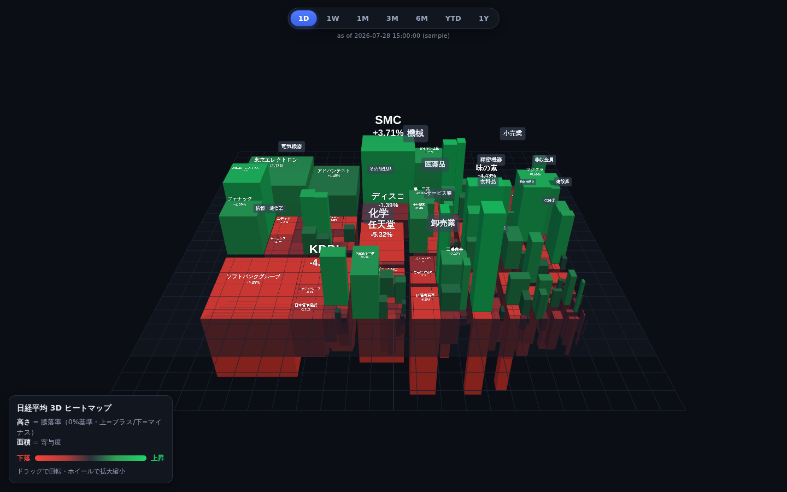

# 3D 株価指数ヒートマップ (3D Stock-Index Heatmap)

株価指数のヒートマップは finviz や nikkei225jp.com のように **2次元（平面）** の
treemap が一般的です。本プロジェクトはそこに **高さ（第3の次元）** を加え、
カーソルのドラッグで **360度回転** できるインタラクティブな 3D ヒートマップです。
画面右上のスイッチャーで **5指数** を切り替えられます:

- **NIKKEI** … 日経平均225（株価加重・J-Quants）
- **DOW30** … NYダウ工業株30種（株価加重・Yahoo Finance）
- **NASDAQ 100** … NASDAQ 100指数（時価総額加重・Yahoo Finance）
- **SENSEX** … BSE SENSEX（30銘柄・時価総額加重・Yahoo Finance）
- **NIFTY 50** … NSE Nifty 50（50銘柄・時価総額加重・Yahoo Finance）



## エンコーディング

| 視覚要素 | 意味 |
| --- | --- |
| **面積**（footprint, w×d） | **比率（構成ウェイト%）** — その銘柄が指数に占める大きさ |
| **高さ**（height） | **騰落率(%)**（ほぼ線形）。0% を基準面とし、**プラスは上方向 / マイナスは下方向**へ厚みを持たせる |
| **体積**（面積 × 高さ） | **≒ 寄与度**（＝ 比率 × 騰落率）。指数を動かした量が「棒の量感」として現れる |
| **色** | 騰落（**緑=上昇 / 赤=下落**、finviz式）。高さと併用 |

各入力（比率・騰落率）を直交する2チャネル（面積・高さ）へ割り当て、その積である
**寄与度を体積で表現**します。比率は期間でほぼ不変なので、**期間を切り替えても街並み
（面積配置）は固定**され、高さ・色だけが動きます（見やすく、全構成銘柄が常に表示されます）。
銘柄は **業種（セクター）ごとにグルーピング** した squarified treemap で配置します
（日経=33業種、米国=英語のGICSセクター）。

**比率（面積）と寄与度（体積）の定義（指数の加重方式ごと）**

| 指数 | 加重方式 | 比率（面積 ∝ weight%） | 寄与度（≒ 体積・ツールチップ表示） |
| --- | --- | --- | --- |
| NIKKEI 225 | 株価加重 | `PAF × 終値 / Σ(PAF × 終値)` | `換算係数(PAF) × (現在値−基準値) / 除数` |
| DOW30 | 株価加重 | `終値 / Σ終値` | `(現在値−基準値) / 除数`（除数は `Σ最新終値 / ^DJI` から導出） |
| NASDAQ 100 | 時価総額加重 | 構成ウェイト%（浮動株代理で自動追従） | `指数レベル(^NDX) × 構成ウェイト% × 騰落率%` |
| SENSEX | 時価総額加重 | 構成ウェイト%（同上） | `指数レベル(^BSESN) × 構成ウェイト% × 騰落率%` |
| NIFTY 50 | 時価総額加重 | 構成ウェイト%（同上） | `指数レベル(^NSEI) × 構成ウェイト% × 騰落率%` |

## 操作

- **ドラッグ**：360度回転
- **ホイール / ピンチ**：拡大・縮小
- **右ドラッグ**：平行移動
- **ホバー**：銘柄名・コード・業種・騰落率・比率・寄与度をツールチップ表示
- **期間ボタン**（上中央）：`1D / 1W / 1M / 3M / 6M / YTD / 1Y` を切り替え（滑らかにアニメーション）
- **指数スイッチャー**（右上）：`NIKKEI / DOW30 / NASDAQ 100 / SENSEX / NIFTY 50` を切り替え（初回のみ遅延読込＋キャッシュ）
- **言語トグル**（右上）：`日本語 / EN` を切り替え。凡例・ツールチップ・操作ラベルを日英で表示。米国指数の銘柄名は英語、日経は英語社名データ（`nameEn`）が無ければ銘柄コードで代替し、業種はTSE33業種の英名に翻訳
- **スクリーンショット共有**（左上📷 / `X` / `LINE` / リンク）：カメラマークやX/LINEをクリックすると、いま見ているアングル・ズームのまま画像化（上下に指数名・基準日・サイトURL `https://3dheatmap.markets-lab.com/` の帯を焼き込み）。共有は**画像添付が前提**：
  - **画像共有に対応した端末（スマホ等）**：`navigator.share({files})` で**画像そのものを添付**して共有シートを開き、X / LINE などのアプリを選んで投稿（画像付き）。
  - **非対応の環境（多くのPCブラウザ）**：X / LINE の共有リンク（intent URL）は画像を自動添付できない仕様のため、**画像を自動ダウンロード＋投稿画面（テキスト＋URL）を表示**し、保存画像を手動で添付。
  - ※ ワンクリックで画像付き投稿を完全自動化するには X API 等のサーバ連携が別途必要（将来対応可）。
- **時系列アニメーション**（下中央）：▶ で**直近5営業日**の日次騰落を順に再生（各日1秒静止＋1秒で次へ遷移＝計9秒）。スライダーで手動スクラブも可能。初期状態は**最新営業日**にセット（▶ で最古から再生）。アニメ中も通常表示と同じく**面積＝比率（ウェイト）で固定**し、**高さ・色（日次騰落率）だけを動かす**ので銘柄が定位置で拍動して見やすい。期間ボタンを押すと通常表示に戻る
- **ローディング表示**：初回はデータ取得（Worker のEOD集計）に時間がかかるため、描画までスピナー＋「読み込み中…」＋**経過秒数**＋初回目安の全画面オーバーレイを表示（指数切替の初回ロード時も表示）
- **透明度スライダー**（右下）：棒の透明度を 20〜100% で調整（奥の棒を見通せる）
- **宇宙空間の背景**：ヒートマップは星空の中に浮いて見え、回転させると背景（星空）・下の惑星・右上の宇宙ステーションも視点に応じて立体的に動きます（下記）。

## 宇宙空間の背景（3D回転連動）

3Dの強みを活かし、ヒートマップが**宇宙空間に浮遊している**ように見せます。星空は
`scene.background`（全天球テクスチャ）として置かれ、視線方向でサンプルされるため、
**回転すると背景も立体的に動き**、様々な角度から浮遊するヒートマップを鑑賞できます。
下に**惑星**、右上に**宇宙ステーション（デススター風）**を配置。実装は `public/js/space.js`。

- **星空・惑星・ステーションはプログラム生成**（2Dキャンバス→テクスチャ）で**外部ファイル不要**。
  CDN不達／iframe埋め込み／オフラインでも確実に描画されます（自己完結）。
- **背景画像の差し替え**：`public/assets/starfield.jpg` を置くと、手続き生成の星空に代えて
  その画像を全天球背景に使います（**equirectangular＝2:1 の画像を推奨**。フラットな16:9でも
  星は点なので概ね自然ですが、星雲帯は継ぎ目/極の歪みが出ることがあります）。画像が無ければ
  自動的に手続き星空にフォールバックします。
- **惑星画像の差し替え**：`public/assets/jupiter.jpg`（**equirectangular 2:1** の惑星マップ）を
  置くと惑星表面に貼ります。丸い惑星の写真（円盤）は歪むため不可。無ければ手続き惑星のまま。
- **土星風の環**：惑星の赤道面に環を配置。`public/assets/rings.png`（**横長の帯＝ラジアル断面、
  PNGのアルファが透過**）を置くと差し替え。無ければ手続きの環（帯＋カッシーニの空隙）を使用。
  詳細は `public/assets/README.md`。
- **艦隊（下部シルエット）**：ステーション（デススター風）から飛び立った**スーパー・スター・
  デストロイヤー風の宇宙戦艦＋TIEファイター2基**の**下部シルエット**を、ヒートマップの手前・上方に
  配置。初期表示では上端にうっすら、**土星側へ約180度回すと下部シルエットがはっきり現れます**
  （進行方向はステーションから離れる向き）。**SSD は同梱の詳細画像**（`assets/ssd.png`・
  背景透過。無ければ手続きシルエットにフォールバック）、**TIE は手続き生成**（`space.js`）。
- **共有画像にも写り込みます**：📷スナップショット共有は現在のレンダリング（＝宇宙背景ごと）を
  取り込むため、星空・惑星・ステーション・艦隊が共有PNGに含まれます。
- 惑星・ステーションは負荷ゼロ相当（初期化時に一度だけ生成）で、緩やかに自転します。
- **ローディング演出（ハイパースペース）**：初回のデータ読込中（コールドスタート時は 20〜30 秒
  ほど）に**ハイパースペース航行**を全画面で流します。**entry（突入・1回）→ cruise（航行・
  読込中はネイティブ `loop`）→ exit（通常宇宙へ離脱）→ 短いフェードでシーン**へ。動画は
  **3つの独立ファイル**（`public/assets/hyperspace-entry.mp4` / `-cruise.mp4` / `-exit.mp4`）で、
  クリップ内シークを一切行わない設計です（断片化MP4でのシーク不具合＝冒頭へ戻る/静止 を回避）。
  H.264・ミュート・小容量推奨。無ければ従来のスピナー表示にフォールバック。詳細は
  `public/assets/README.md`。

## 実行 / プレビュー

依存を落とさず静的ファイルのみで動きます（ビルド不要）。配信物は `public/` 配下です。

```bash
npx http-server public -p 8000 -c-1
# → http://localhost:8000/   (-c-1 でキャッシュ無効。反映されない時に有効)
```

Three.js は CDN 不達でも動くよう `public/lib/` に同梱（バージョン固定）しています。

## 構成

```
public/                配信物（Cloudflare Pages の出力ディレクトリ）
  index.html           エントリ（importmap で three / OrbitControls を解決）
  css/style.css        UI（期間バー・凡例・ツールチップ・透明度・向き）
  lib/                 three.module.js / OrbitControls.js（vendor）
  js/main.js           scene / camera / OrbitControls / ライト / 地面 / ループ
  js/space.js          宇宙背景（星空スカイ・惑星・デススター風ステーション）
  js/treemap.js        squarified treemap（業種→銘柄の2階層）
  js/heatmap.js        bar mesh・色・ラベル・期間切替アニメ・透明度/X線・凹凸反転
  js/color.js          騰落率(%) → 色
  js/ui.js             期間ボタン・ツールチップ・凡例・透明度・共有ボタン・タイムラインバー
  js/share.js          スナップショット撮影＋帯合成＋共有/DL/X/LINE/コピー
  js/timeline.js       直近5営業日アニメーションの再生コントローラ
  js/data-source.js    データ読み込み層（指数別エンドポイント・サンプルフォールバック）
  data/ni225.js        NIKKEI サンプル（window.HEATMAP_SAMPLE.NIKKEI）
  data/dow30.js        DOW30 サンプル（window.HEATMAP_SAMPLE.DOW30）
  data/nasdaq100.js    NASDAQ100 サンプル（window.HEATMAP_SAMPLE.NASDAQ100）
  data/sensex.js       SENSEX サンプル（window.HEATMAP_SAMPLE.SENSEX）
  data/nifty50.js      NIFTY 50 サンプル（window.HEATMAP_SAMPLE.NIFTY50）
  assets/              背景画像の差し替えスロット（starfield.jpg・任意。無ければ手続き星空）
  _headers             Cloudflare Pages のキャッシュ設定
scripts/gen_sample.mjs    NIKKEI サンプル生成スクリプト
scripts/gen_sample_us.mjs DOW30 / NASDAQ100 / SENSEX / NIFTY50 サンプル生成スクリプト
server/                データプロキシ（Cloudflare Worker）
  worker.js               NIKKEI: J-Quants V2 → 寄与度
  us-worker.js            DOW30 / NASDAQ100 / SENSEX / NIFTY50: Yahoo Finance → 寄与度（?index=dow|nasdaq|sensex|nifty）
  build-params.mjs        NIKKEI パラメータ（PAF・除数）ビルド
  build-us-params.mjs     国際指数パラメータ（構成銘柄・時価総額ウェイト）ビルド
  us-constituents.mjs     Dow30 / Nasdaq100 / SENSEX / NIFTY50 の構成銘柄（共有）
  wrangler.toml           NIKKEI Worker 設定
  wrangler-us.toml        米国 Worker 設定
```

## デプロイ（Cloudflare Pages · Git連携）

`public/` を配信します。Cloudflare Pages でこのリポジトリを接続し:

- **Build command**: （空）
- **Build output directory**: `public`
- **Production branch**: 運用ブランチ（例: `main`）

以後は push で自動デプロイ。カスタムドメインに `3dheatmap.markets-lab.com` を追加します。

### Worker の自動デプロイ（GitHub Actions）

データAPI（Worker）は2つ（`ni225-heatmap-proxy` / `us-heatmap-proxy`）あります。
`server/` 配下の Worker ソースが `main` に入ると、GitHub Actions
（`.github/workflows/deploy-workers.yml`）が**両 Worker を自動デプロイ**します。
`node --test server/timeline.test.mjs` を先に通すゲート付きで、失敗する変更はデプロイ
されません。手動起動（`workflow_dispatch`）も可能です。

必要なリポジトリ Secret（Settings → Secrets and variables → Actions）:

| Secret | 用途 |
| --- | --- |
| `CLOUDFLARE_API_TOKEN` | Cloudflare の API トークン（権限: **Workers Scripts: Edit**） |
| `CLOUDFLARE_ACCOUNT_ID` | Cloudflare アカウント ID |

> `JQUANTS_API_KEY` は **CI には不要**です。Cloudflare 側の Worker シークレットに保存済みで、
> `wrangler deploy` は既存シークレットを上書きしません。

### 監視（ヘルスチェック）

`.github/workflows/health-check.yml` が定期的（既定 6 時間毎・`cron` で調整可）に3エンドポイントを
叩き、`error` 返却や `constituents` 空を検知したらワークフローを失敗させます（＝ GitHub が
リポジトリ所有者へメール通知）。「サンプルへ黙ってフォールバック」していた状態を早期に検知
するための仕組みです。

### 手動デプロイ（緊急時のフォールバック）

CI が使えない場合のみ、`server/` 配下から手動でデプロイできます:

```bash
cd server
# NIKKEI（J-Quants V2 / 要APIキー）
wrangler secret put JQUANTS_API_KEY   # 初回のみ
wrangler deploy                       # wrangler.toml を使用

# DOW30 / NASDAQ100 / SENSEX / NIFTY 50（Yahoo Finance / キー不要）
wrangler deploy --config wrangler-us.toml
```

> 手動デプロイ時は必ず `git pull` で最新 `main` を取得してから実行してください（古いローカル
> チェックアウトの再デプロイが過去の障害原因でした）。

デプロイ先URLはフロントの `js/data-source.js` の `CONFIG.endpoints` に設定済みです
（国際指数は `?index=dow` / `?index=nasdaq` / `?index=sensex` / `?index=nifty` を付与）。
いずれかが不達でも、該当指数はバンドル済みサンプルに自動フォールバックします。

## データの差し替え（実データ連携）

`public/data/*.js` は **サンプルデータ**（実在の株価ではありません）で、ライブAPIが
不達のときのフォールバックです。各指数は `window.HEATMAP_SAMPLE[indexKey]` に同じ形で
格納されます（`indexKey` = `NIKKEI` / `DOW30` / `NASDAQ100` / `SENSEX` / `NIFTY50`）。

```js
window.HEATMAP_SAMPLE['NIKKEI'] = {
  "1D": {
    asOf: "2026-07-28T15:00:00+09:00",
    constituents: [
      { code: "6857", name: "アドバンテスト", sector: "電気機器",
        changePct: -10.04,      // 騰落率(%) → 高さ・色
        weight: 7.93,           // 比率（構成ウェイト%）→ 面積
        contribution: -687.87 } // 寄与度（符号付き, 指数ポイント）≒ 体積・ツールチップ表示
      /* … 225銘柄 … */
    ]
  },
  "1W": { … }, "1M": { … }, "3M": { … }, "6M": { … }, "YTD": { … }, "1Y": { … },

  // 時系列アニメーション（任意）: 直近5営業日の日次フレーム。
  // 面積(weight)は各銘柄の比率で全フレーム共通に固定し、
  // 高さ・色(changePct=その日の前日比)だけが動く（銘柄は定位置）。
  "TIMELINE": {
    "frames": [
      { "asOf": "2026-07-22",
        "constituents": [
          { "code": "6857", "name": "アドバンテスト", "sector": "電気機器",
            "changePct": -1.23,   // その日の前日比(%) → 高さ・色
            "weight": 7.93 }      // 固定の比率(%) → 面積（全フレーム同値）
        ] },
      /* … 古い→新しい 5フレーム … */
    ]
  }
};
```

TIMELINE の固定サイズ（面積 = weight%）は各指数のウェイト代理を正規化した比率：
NIKKEI=`paf×最新終値`、DOW=`最新終値`（株価加重）、NASDAQ=`weight%`（時価総額加重）。両Worker（日経=J-Quants
の直近6営業日、米国=取得済み1年日足の末尾6終値）が同じ形で `TIMELINE` を返します。
将来は日中の値動き（J-Quants 分足・5分間隔など）をフレーム化して同じ仕組みで再生できます。

サンプルの再生成:

```bash
node scripts/gen_sample.mjs      # → public/data/ni225.js
node scripts/gen_sample_us.mjs   # → public/data/dow30.js, public/data/nasdaq100.js
```

### JPX API連携（実データ）

`js/data-source.js` の `CONFIG.endpoint` にバックエンドのURLを設定すると、
サンプルの代わりにそのAPIから取得します（返却は上記と同じ形）。

```js
// js/data-source.js
export const CONFIG = { endpoint: 'https://<your-host>/api/ni225-heatmap' };
```

**なぜバックエンドが必要か**：JPXの株価API（例: 15分遅延 株価情報API）は
**有料・認証必須**で、ブラウザからの直接呼び出し（CORS）ができません。また
APIが返すのは*株価*であり、寄与度は別途計算が必要です。そこで小さなサーバ
（プロキシ）でAPIキーを保持し、株価を取得→寄与度を計算→上記JSONを返します。

### 国際指数（DOW30 / NASDAQ100 / SENSEX / NIFTY 50）— Yahoo Finance連携

この4指数は `server/us-worker.js`（Cloudflare Worker）が **Yahoo Finance** から
日足を取得し、寄与度を計算して同じ形のJSONを返します
（`?index=dow` / `?index=nasdaq` / `?index=sensex` / `?index=nifty`）。
Yahoo は **APIキー不要** ですが、ブラウザ直叩き（CORS）とレート制限のためプロキシ経由にします。
構成銘柄の日足は Yahoo の **spark エンドポイント**（`?symbols=A,B,C…` で複数銘柄を1回で取得）
でまとめて取り、外部fetch回数を抑えます（DOW≈2、NASDAQ≈5、SENSEX≈2、NIFTY≈3リクエスト＋指数1）。
これは Cloudflare 無料プランの **1リクエストあたり50サブリクエスト上限** に収めるためで、以前の
「1銘柄1リクエスト」方式では NASDAQ 100（≈101リクエスト）が上限を超えてサンプルへ
フォールバックしていました。

- Yahooのティッカー：**BSE**（SENSEX）は数値スクリップコード＋`.BO`（例 `500325.BO`＝Reliance）、
  **NSE**（Nifty 50）はシンボル＋`.NS`（例 `RELIANCE.NS`）。指数レベルは `^BSESN` / `^NSEI`。
- 構成銘柄・時価総額ウェイトは `server/us-constituents.mjs`（同梱シード）にあり、
  `node server/build-us-params.mjs` で `server/us-index-params.json` を生成します。
- **NASDAQのウェイトを最新化**するには、Invesco QQQ の保有CSVを
  `server/qqq_holdings.csv` に置いて（`Ticker` / `Name` / `Weight` / `Sector` 列）再ビルドします。
- **時価総額加重の半自動ウェイト**（NASDAQ / SENSEX / Nifty）：Worker は各銘柄のウェイトを
  **params 基準日（`asOfParams`）からの株価変動に応じてライブ再計算**します（浮動株プロキシ：
  ウェイト ∝ 基準ウェイト × 現在値/基準値 を100%に再正規化）。浮動株数はリバランス間ほぼ一定
  という前提で、**日々の値動きには自動追従**します。手動更新は**構成銘柄・浮動株が変わる
  リバランス時（SENSEX＝6/12月、Nifty＝3/9月）だけ**で十分です。
- **SENSEX / NIFTY の基準ウェイトを更新**するには、`server/sensex_weights.csv` /
  `server/nifty_weights.csv`（`Ticker`＝コード, `Weight`＝% の列）を置いて再ビルドします
  （CSVがあれば同梱シードより優先。SENSEX・Nifty は時価総額加重で `^BSESN` / `^NSEI` を使用）。
  再ビルド時に `asOfParams` が更新され、以降その日を基準に株価追従します。
- DOWは株価加重のため、Workerが `^DJI` から除数を導出します（ウェイト不要）。
- Yahoo は非公式APIのため、レート制限や仕様変更で不安定になる場合があります。その際は
  該当指数がサンプルへフォールバックします（恒常運用ではAPIキー型プロバイダへ差し替え可）。

寄与度の計算（`fromJpxQuotes()` に実装済み。日経平均は株価換算係数付きの
株価平均型指数）:

```
指数        = Σ(株価 × 換算係数) / 除数
騰落率(%)   = (現在値 − 前日終値) / 前日終値 × 100
寄与度      = 換算係数 × (現在値 − 前日終値) / 除数   （指数ポイント）
```

したがってサーバ側では、JPXの株価に加えて **各銘柄の換算係数（PAF）** と
**日経平均の除数（Divisor）** が必要です（いずれも指数公表元の値）。

## markets-lab.com への埋め込み

一式（このフォルダ）をホスティングし、iframe で埋め込みます。

```html
<iframe src="https://3dheatmap.markets-lab.com/"
        style="width:100%;height:80vh;border:0;" loading="lazy"
        title="3D 株価指数ヒートマップ"></iframe>
```

## ライセンス

MIT
